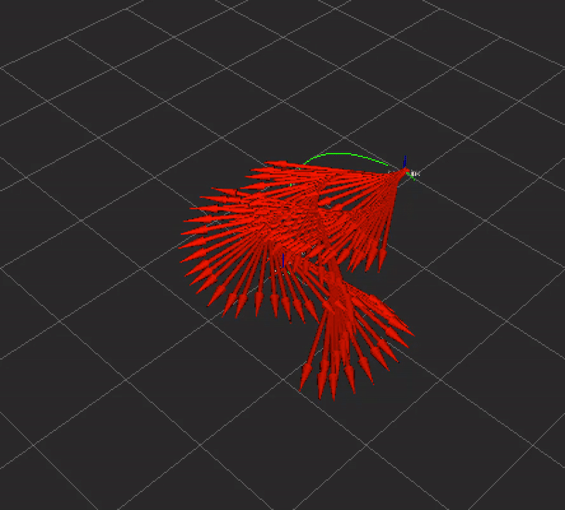

# ROS 2 NMPC Tracker: Nonlinear Model Predictive Control

A lightweight, high-performance Nonlinear Model Predictive Control (NMPC) implementation for ROS 2 Humble. This project demonstrates advanced trajectory tracking and dynamic obstacle avoidance using mathematical optimization, designed to run efficiently on Virtual Machines (UTM/Mac) without GPU requirements.

<p align="center">
  
</p>


---

## Project Structure
```
nmpc_ws/
└── src/
└── nmpc_tracker/
├── config/
│ └── view_bot.rviz # Pre-configured RViz visualization
├── launch/
│ └── nmpc_launch.py # Main launch file (Sim + Controller + RViz)
├── nmpc_tracker/
│ ├── init.py
│ ├── nmpc_controller.py # CasADi solver & Control Logic
│ └── simple_sim.py # Lightweight Python physics engine
├── package.xml # ROS 2 Package dependencies
├── setup.py # Python package setup

```
## Features

- Real-Time Optimization using CasADi at 10 Hz.
- Predictive Horizon of \( N = 20 \) steps (2 seconds).
- Dynamic Obstacle Avoidance using potential fields.
- Lightweight Python-based simulation (no Gazebo required).
- Visual debugging in RViz2 with predicted paths and reference trajectories.

---

## How It Works (The Math)

Unlike a PID controller, this NMPC controller solves an optimization problem at each step to minimize a future cost function.

### 1. Cost Function

The optimizer minimizes tracking error, control effort, and obstacle penalty:

$$
J = \sum_{k=0}^{N} \left(
\left\| x_k - x_{\text{ref}} \right\|_Q^2
+
\left\| u_k \right\|_R^2
+
\frac{W}{\text{dist}^2 + \epsilon}
\right)
$$


### 2. Constraints

Subject to Unicycle Model dynamics:

$$
J = \sum_{k=0}^{N} \left(
\left\| x_k - x_{\text{ref}} \right\|_Q^2
+
\left\| u_k \right\|_R^2
+
\frac{W}{\text{dist}^2 + \epsilon}
\right)
$$


Control limits:

$$
\begin{aligned}
x_{k+1} &= x_k + v_k \cos(\theta_k)\,\Delta t \\
y_{k+1} &= y_k + v_k \sin(\theta_k)\,\Delta t \\
\theta_{k+1} &= \theta_k + \omega_k\,\Delta t
\end{aligned}
$$


---

# Installation & Usage

## Prerequisites

- Ubuntu 22.04 (Jammy)
- ROS 2 Humble
- Python 3 packages: `casadi`, `numpy`, `transforms3d`

## Build Instructions

1. Clone or create the package inside your workspace `src/` folder.

2. Install dependencies:

```
pip3 install casadi numpy transforms3d
sudo apt-get install ros-humble-tf-transformations
```
3. Build the workspace:
```
cd ~/nmpc_ws
colcon build
source install/setup.bash

ros2 launch nmpc_tracker nmpc_launch.py
```


4. Launch the simulator, controller, and RViz:

```
ros2 launch nmpc_tracker nmpc_launch.py
```
Visualization

The system publishes real-time visualizations in RViz:

Green Line: Reference trajectory (Figure-8).

Red arrows / odometry: Actual robot path.

Coordinate Frame: Real-time robot pose.

License

The MIT License (MIT)
Copyright (c) 2024 [Your Name]

Permission is hereby granted, free of charge, to any person obtaining a copy
of this software and associated documentation files (the "Software"), to deal
in the Software without restriction...


